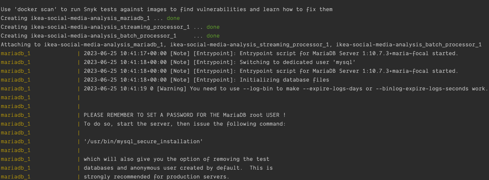
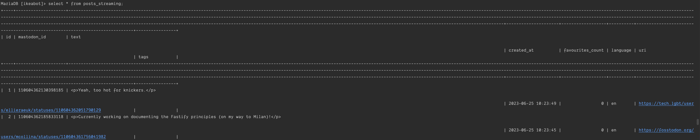

# ikea-social-media-analysis

## Introduction

Collect posts from Mastodon that related to IKEA using the Mastodon API, then saving the posts in MariaDB.

## Design

`batch_processor` is designed for batch processing for the API data, it queries and collects the posts with 'IKEA' as their tag.

`streaming_processor` is designed for streaming processing, since the streaming data that related to IKEA are usually empty, currently it is using `stream_public` method to streaming all posts.

`batch_processor.py` and `streaming_processor.py` are inherited from `base_processor` which is designed to reuse functions and modules. 

Simplified design diagram


## Related Docs

[Mastodon Streaming API methods](https://docs.joinmastodon.org/methods/streaming/) related to `streaming_processor`

[Mastodon.py Streaming](https://mastodonpy.readthedocs.io/en/stable/10_streaming.html#module-mastodon) used by `streaming_processor`

[Mastodon hashtag timeline API](https://docs.joinmastodon.org/methods/timelines/#tag) used by `batch_processor`

## Usage

### Setup and Environment

[Install Docker](https://docs.docker.com/engine/install/) and [install Docker-Compose](https://docs.docker.com/compose/install/).

The service can be run with `docker-compose up --build`, stopped with `CTRL + C` and taken down with `docker-compose down`.
To clean up any containers when done, you can use `docker-compose rm`.
The `docker-compose rm` command is useful when modifying the database schema, as mariadb only runs the scripts found in `database/` upon the first load from a clean environment.

The scripts use and are tested by Python 3.9.

#### Screenshots
Example for running services



### SQL

SQL database: MariaDB

After the services run and finish, you can examine and query the data in MariaDB.
To examine the state of the mariadb tables, we can exec into the docker container with the following commands:

```
docker exec -it ikea-social-media-analysis_mariadb_1 bash
mysql -u ikeabot -pikeabot
use ikeabot
SELECT * FROM posts_streaming LIMIT 10;
SELECT * FROM posts_batch LIMIT 10;
```

#### Screenshot
Example for query posts_streaming



### Table structure
```
  `id` BIGINT(19) UNSIGNED NOT NULL AUTO_INCREMENT,
  `mastodon_id` VARCHAR(50) NOT NULL,
  `text` NVARCHAR(2000),
  `created_at` DATETIME,
  `favourites_count` INT,
  `language` VARCHAR(10),
  `uri` VARCHAR(255),
  `tags` NVARCHAR(255),
  PRIMARY KEY (`id`),
  KEY (`mastodon_id`)
```
For more DB table information, please refer to `database/init.sql`
